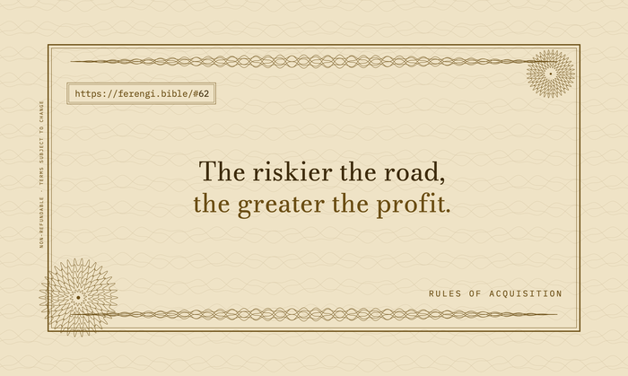

# Print Your Own Rules On Business Cards

Print your favorite Rules of Acquisition as business cards. Services like
[MakePlayingCards](https://makeplayingcards.com/) or
[MOO](https://www.moo.com/us/business-cards/original) let you print a deck where
every card is different, and the images here fit their design guidelines.

Each card has a shared **front** and a per-rule **back**. The design is a
"latinum certificate": guilloche engraving, a rosette watermark, and the rule's
URL set like a banknote serial number. Pick one of the two color schemes below,
upload the front once, then add as many rule backs as you like.

## Cream

An engraved bearer bond: dark engraving on a light stock. Fine positive lines
hold well in plain ink.

Files: `cream/front.png` and `cream/backs/NNN.png`

## Dark

A banknote: gold engraving reversed out of deep umber.

Files: `dark/front.png` and `dark/backs/NNN.png`

## How to print

1. Pick a scheme folder, [`cream/`](cream/) or [`dark/`](dark/).
2. Upload that folder's `front.png` as the shared face for every card.
3. Upload each `backs/NNN.png` you want as the unique faces. `NNN` is the rule
   number, so `backs/062.png` is Rule 62. Read any rule at
   `https://ferengi.bible/#NN` (for example
   [Rule 62](https://ferengi.bible/#62)).

If asked, order a duplex print with a long-edge flip so the front and back line
up.

## Print specifications

Standard 3.5 x 2 inch US business card at 800 DPI, with a 3.74 x 2.24 inch bleed
area and a 3.26 x 1.76 inch safe zone, matching the MakePlayingCards template.

## Cost

Printing is cheap. On MakePlayingCards the going rate has been around $17 for a
set of 60 and about $34 for the full deck. Prices change, so check before you
order.

## Regenerating the images

The cards are produced by [`../generate-cards.py`](../generate-cards.py) from
[`../rules.txt`](../rules.txt). See [`AGENTS.md`](AGENTS.md) for how the
generator works, the design decisions behind it, and how to run it.
